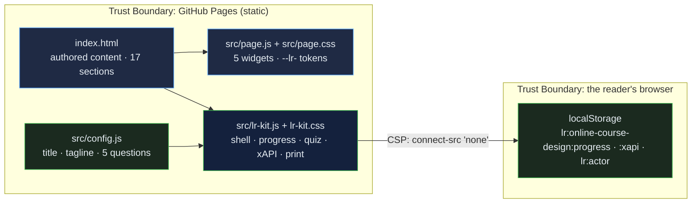

# Online Course Design Studio: a graduate-level instructional-design playbook for online, blended and HyFlex courses, with a backward-design module builder, an objective assembler, a rubric builder and two course-quality self-checks

[](https://github.com/Freddricklogan/online-course-design/actions/workflows/deploy.yml)
[](#5-getting-started--verification)
[](https://github.com/Freddricklogan/online-course-design/actions/workflows/codeql.yml)
[](LICENSE)
[](https://freddricklogan.github.io/online-course-design/)

## 1. Executive Summary & Business Impact

**Problem statement.** Faculty asked to move a course online, and the instructional designers who help them, start from the content: record the lectures, post the readings, add a discussion board. The objectives are implicit, the assessments test what was convenient, presence is left to chance, and the course fails a quality review it never knew it would face. The frameworks — ADDIE, backward design, Bloom, the Community of Inquiry, cognitive load — are known by name; the discipline of making objectives, assessments and activities agree is not practised.

**Solution & value delivered.** A seventeen-section playbook that puts alignment at the centre: three design models, four learning theories, Gagné's nine events and Merrill's first principles, cognitive load and multimedia rules, measurable objectives, assessment that measures and holds up online, modalities, the Community of Inquiry and facilitation rhythm, a storyboard template, tools by function, and course review — with a backward-design module builder that shows the assessment and activity types aligned to a chosen Bloom level and verb, an ABCD objective assembler, a mini rubric builder, and two self-checks modelled on alignment-centred quality frameworks. The page is one of ten
resources built on the shared
[Learning Resource Kit](https://github.com/Freddricklogan/learning-resource-kit):
an Executive Shell with live counts, collapsible sections whose progress is
saved in the reader's browser, a five-question quiz written for this
resource that records xAPI 1.0.3 statements locally, and a print layout that
opens every section. Nothing leaves the page; the content-security policy
forbids network calls.

**[→ Read the full case study](docs/CASE_STUDY.md)**

| Outcome | How this repo delivers it |
| --- | --- |
| A resource, not a slide deck | 17 sections (20 minutes at 230 wpm) with an executive summary first: what instructional design is, three design models, learning theories, Gagné's nine events, Merrill's first principles, cognitive load and multimedia, backward-design module builder, ABCD objectives, assessment, modalities, Community of Inquiry, facilitation, storyboard template, tools by function, course-alignment self-check, QM-style review, glossary |
| Interactive where it matters | 5 authored widgets (see §4) kept intact through the conversion and verified under a strict CSP |
| Evidence of learning | Quiz answers and completion recorded as xAPI statements with an anonymous actor; inspectable on the page |
| Reviewable by an institution | No inline script or style, typed buttons, table bodies, a `<main>` landmark; html-validate and ESLint in CI |
| Usable everywhere | Keyboard-operable sections, deep links that open their section, print stylesheet, no horizontal scroll at 400 px |

## 2. Demonstrated Competencies & Technical Skills

- **EdTech & Human-Centered Design** — alignment made visible: the module builder demonstrates constructive alignment live, the storyboard puts every objective's content, activity, assessment and check on one row, and the self-checks make the reader audit their own course before the page names what a review would find; the Quality Matters-style check is labelled illustrative, not the official rubric.
- **Systems Architecture & CS** — authored content in `index.html`, its
  widgets in `src/page.js`, its styles in `src/page.css` under the `--lr-`
  namespace; the kit vendored as `src/lr-kit.js`; config and tests that
  fail CI if a quiz question is malformed.
- **Cybersecurity & Compliance** — `default-src 'none'; script-src 'self';
  connect-src 'none'`; no third-party script; Trivy, npm audit and CodeQL in
  CI.
- **Data Science & AI** — reading time and section counts computed from the
  content at load; scores recorded as scaled results, never claimed.

## 3. System Architecture & Data Flow



## 4. Technical Highlights & Engineering Decisions

### The authored widgets

| Widget | What it does |
| --- | --- |
| Backward-Design Module Builder | Choose a Bloom level and a matching action verb; the builder shows the aligned assessment and activity types and an alignment status |
| ABCD objective assembler | Toggle Audience, Behavior, Condition and Degree to assemble a complete measurable objective |
| Mini rubric builder | Add criteria to an analytic rubric table with three performance levels |
| Course-alignment self-check | Weighted checklist — measurable objectives, assessment and activity alignment, structure, accessibility — with a bar and verdict |
| QM-style 8-standard review | Illustrative self-check mirroring the eight general standards of the Quality Matters concept; counts standards met and judges review-readiness |

### ADR-1 — Convert, do not rewrite

**Context.** The original was one hand-authored file: rich content and
bespoke widgets, but inline styles and scripts that no content-security
policy or validator accepts.

**Decision.** The kit's converter moved the stylesheet and scripts out of
the page, replaced 96 inline style attributes with
23 generated classes, namespaced 26 custom properties, typed
7 buttons, gave 11 tables a body and wrapped the content in a `<main>` landmark. The content and
widget code were not rewritten; `AUDIT.md` lists every change.

**Consequence.** The page passes html-validate under a strict CSP with its
original behaviour intact, and the change is auditable line by line.

### ADR-2 — One quiz, one attempt, standard statements

**Context.** The page's own self-checks vanish on reload and record nothing.

**Decision.** Five questions written from this resource's content live in
`src/config.js`; the kit accepts a single attempt per question, shows the
explanation, and records xAPI *answered* and *completed* statements with a
scaled score, kept in the browser and shown as JSON.

**Consequence.** The score reflects what the reader knew before the
explanation, and an institution can see the exact statements a learning
record store would receive.

### ADR-3 — Progress means opened

**Context.** Scroll depth is easy to measure and says little about reading.

**Decision.** A section counts as opened when its collapsed state is
removed — by click, keyboard, deep link or "Expand all" — and an
*experienced* statement is recorded once.

**Consequence.** The KPI strip is conservative: 17 sections, and the count
only rises when the reader opens one.

## 5. Getting Started & Verification

**Prerequisites.** Node 22 for the checks; the page itself needs only a
browser.

```bash
git clone https://github.com/Freddricklogan/online-course-design.git
cd online-course-design
npm ci
npm run check     # eslint → html-validate → vitest
npx serve .       # open http://localhost:3000
```

**Verification — the numbers this repository actually produced:**

```bash
npm run lint      # 0 problems
npm run validate  # html-validate index.html: clean
npm run coverage  # 7 passed; All files 79.84% (config.js 100%, vendored lr-kit.js 78.75%)
```

| Check | Result |
| --- | --- |
| Unit tests (Vitest, jsdom) | **7 passed / 7** across 2 files — quiz validity, page invariants, the kit mounted on this page |
| Coverage | All files **79.84%** statements: `src/config.js` 100%, vendored `src/lr-kit.js` 78.75% from this page's smoke test (the kit's own suite covers it at 99%) |
| ESLint, html-validate | clean |
| Conversion audit | 96 inline styles → 23 classes · 26 tokens namespaced · 7 buttons typed · 11 tables fixed |
| Headless Chrome smoke | **0 console errors**; all 5 widgets exercised; sections opened 17/17 on Expand all; no horizontal scroll at 1200 or 400 px |

## 6. Live Demo & Production Showcase

**<https://freddricklogan.github.io/online-course-design/>**

**30-second guided walkthrough.** Press **Take the 30-second tour**.

1. **A graduate-level resource, not a slide deck** — 17 sections, about
   20 minutes of reading.
2. **Open a section** — the first section opens and the count rises.
3. **Check your understanding** — five questions on alignment, cognitive load, ABCD objectives, the Community of Inquiry and rubrics.
4. **Your statements, inspectable** — the xAPI JSON recorded in this browser.

The quiz covers:
- constructive alignment
- extraneous cognitive load
- the ABCD method
- the three presences of the Community of Inquiry
- analytic versus holistic rubrics

Part of the resource hub at <https://freddricklogan.github.io/resources/>.
